  

 

### ◈ Featured Projects & Hardware

* 🔬 **[Nexus Academy](https://github.com/hasan-circuito/nexus-academy)**  
  *Flagship Learning Platform* — An in-browser Python learning engine in Bangla. Runs Python completely on the client side via Pyodide WebAssembly with zero server compute overhead. Engineered with 1,640+ automated test assertions passing 100%.

* 📡 **ESP8266 IoT Thief Detector**  
  *Hardware Security Device* — Built on an ESP8266 microcontroller wired on a breadboard with motion sensors to detect room intrusion and send instant Wi-Fi alerts.

* 📱 **[Personal App Blocker](https://github.com/hasan-circuito/personal-App-blocker-)**  
  *Android Productivity Tool* — Built to lock down distracting apps during study sessions. Prototyped using Google AI Studio to solve a real personal productivity bottleneck.

---

### ⬡ Background & Contact

* 🎓 **Academics**: B.Sc. in Electrical & Electronic Engineering (EEE Undergrad.Ongoing)
* 🏢 **Real-World Context**: Hands-on exposure observing accounts tracking and customer workflows at a real estate firm in the UAE
* 📬 **Email**: `hasan.circuito@gmail.com`
* 🌐 **GitHub**: [@hasan-circuito](https://github.com/hasan-circuito)

---

  

